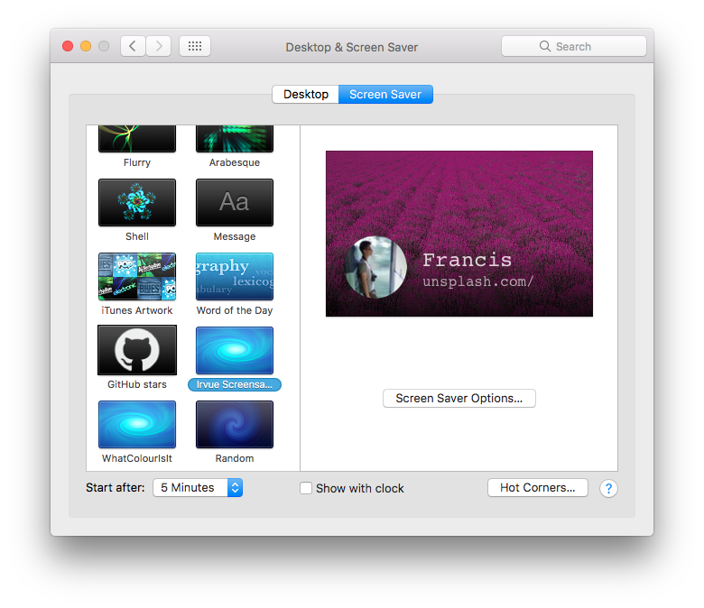
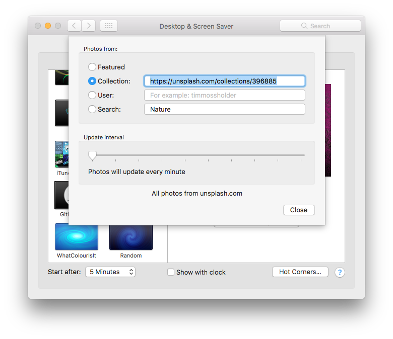

# Irvue Screensaver

Screensaver with images from [Unsplash](https://unsplash.com).

## How to install

1. Download [Irvue Screensaver.saver](https://github.com/leonspok/Irvue-Screensaver/releases)
2. Double click it and it will appear in System Preferences:
3. Change source and update duration to desired: